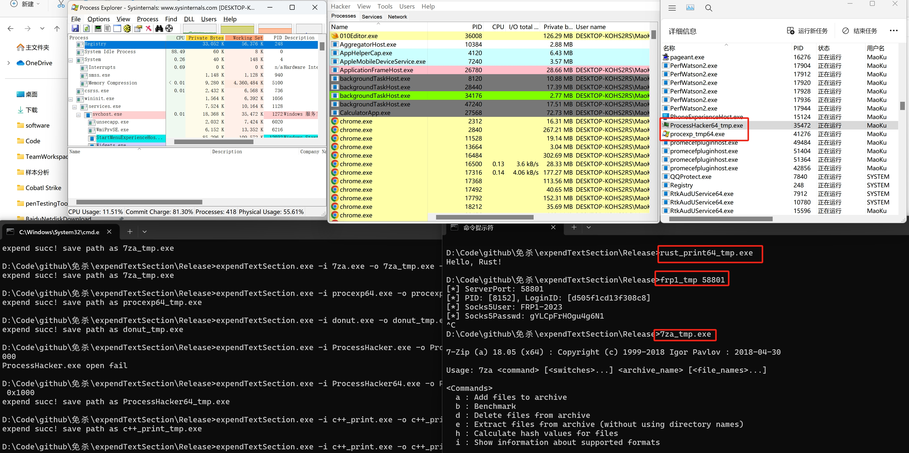

# expandTextSection
 [](https://github.com/Neo-Maoku/expandTextSection/stargazers)

一款无损扩充PE文件的text段大小的工具，支持32和64位程序。

### 项目演示
https://github.com/Neo-Maoku/expandTextSection/assets/26914648/99378d69-9383-4908-a811-ac89303c64c4

### 项目适配测试

- 支持32位和64位PE程序text段扩充，扩展工具目前只有32位程序

  

- 扩充程序需要有重定位表

- 扩充32位程序比64的程序的兼容性好。因为64位程序很多数据没有用重定位表，需要反汇编字节码查看是否要添加偏移，导致会有部分数据处理失误。

### 项目使用vs 2022编译

### B站地址

【一款自研的无损扩充PE文件的text段大小的工具，助力木马免杀。】 https://www.bilibili.com/video/BV1yi421k7cj/?share_source=copy_web&vd_source=c75cdcc6b49a06fd849f2d392e8e3218

### 使用说明

-o：扩充后的文件保存路径，默认是在文件名后添加"_tmp"标识

-i：需要扩充的文件路径

-a：要扩充的大小，16进制

```c
expandTextSection.exe -i ProcessHacker.exe -a 0x15ff
expandTextSection.exe -i procexp.exe -o procexp_tmp.exe -a 0x18ff
```

### 版本更新日志

V1.0.0

1. 给text段扩充大小
1. 使用zydis框架对64位程序text段反汇编
